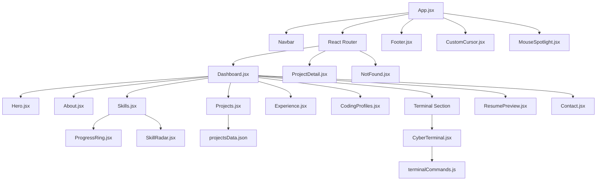

# 🏗️ Architecture Guide — Cybersecurity Portfolio v5.0

This document outlines the directory structure, component hierarchy, state management, and asset flow for the portfolio.

---

## 📂 Project Structure

```text
personal-web/
├── public/                 # Static assets (PDFs, SVGs, favicon, robots, sitemaps)
├── src/
│   ├── assets/             # Images, fonts, styles
│   ├── components/         # Reusable core visual components
│   │   ├── CustomCursor.jsx
│   │   ├── CyberTerminal.jsx
│   │   ├── MatrixRain.jsx
│   │   ├── MouseSpotlight.jsx
│   │   ├── Navbar.jsx
│   │   ├── ProgressRing.jsx
│   │   └── SkillRadar.jsx
│   ├── data/               # Static dataset models
│   │   └── projectsData.json
│   ├── pages/              # Primary route views
│   │   ├── Dashboard.jsx
│   │   ├── NotFound.jsx
│   │   └── ProjectDetail.jsx
│   ├── sections/           # Section layouts loaded in Dashboard
│   │   ├── About.jsx
│   │   ├── Contact.jsx
│   │   ├── CodingProfiles.jsx # Consolidated profiles & contributions
│   │   ├── Experience.jsx     # Chronological milestones & timeline
│   │   ├── Footer.jsx
│   │   ├── Hero.jsx
│   │   ├── Projects.jsx
│   │   └── ResumePreview.jsx
│   ├── utils/              # Helper script functions and logic
│   │   ├── analytics.js    # Privacy-friendly session tracking
│   │   └── terminalCommands.js
│   ├── App.css
│   ├── App.jsx             # Router definition and layout shell
│   ├── index.css           # Core styling layer and design system
│   └── main.jsx            # Application entrypoint
├── index.html              # HTML shell & SEO configuration
├── package.json
└── vite.config.js
```

---

## 🔀 Component Hierarchy & Layout



---

## 💾 Data & State Management

### 1. Projects Dataset (`projectsData.json`)
The application operates on a single source of truth for portfolio project items.
- Sourced dynamically by `Projects.jsx` (main listing page) and `ProjectDetail.jsx` (deep-dive audit reports).
- Allows easy updates without modifying components directly.

### 2. Contact Form & EmailJS Integration
The `Contact.jsx` component uses a direct API client to submit contact details to EmailJS asynchronously.
- Uses Vite environment variables for authentication keys.
- Implements string sanitization and socket verification before executing transmission payloads.

### 3. Terminal Logic (`terminalCommands.js` & `CyberTerminal.jsx`)
- Command registry: `terminalCommands.js` exposes pure functional arrays of strings representing logs.
- Command parser: `resolveCommand()` splits user inputs, matches commands, runs asynchronous tasks (e.g. `hack` matrix parser or `matrix` stream), and resolves output lines.
- Navigation state: CyberTerminal.jsx monitors current folder levels statefully, updating display prompts in bash style.
